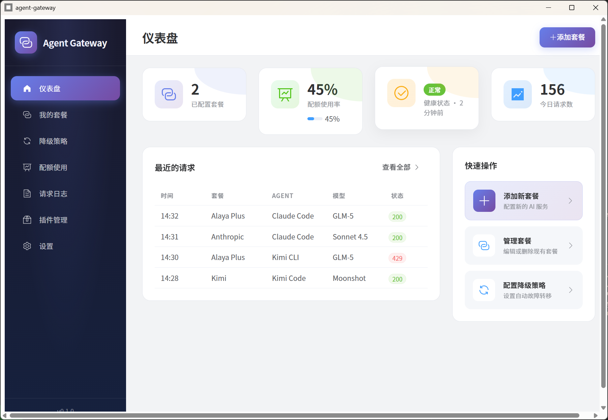

# Agent Gateway

Unified gateway for managing multiple AI coding tools with provider-plan-model-agent hierarchy, automatic fallback, quota control, and protocol translation.

<div align="center">  

📖 [中文](README_zh-CN.md)

</div>

## Features

- **Multi-Provider Support**: Claude Code, Kimi Code, OpenCode, Kilo CLI
- **Protocol Translation**: Bidirectional Anthropic ↔ OpenAI API conversion
- **Automatic Fallback**: Intelligent failover on rate limits, errors, or quota exhaustion
- **Quota Management**: Per-plan usage tracking and limits
- **Multiple Interfaces**: CLI, Desktop GUI (Tauri), REST API, and Library mode
- **Secure Storage**: AES-256-GCM encrypted API key storage
- **Plugin System**: WASM-based extensibility via wasmtime + WASI

## Architecture

```txt
┌─────────────────────────────────────────────────┐
│  CLI (agw-cli) │ GUI (agw-gui) │ API (agw-api) │
└──────────────────────┬──────────────────────────┘
                       ↓
┌─────────────────────────────────────────────────┐
│               agw-core (shared crate)           │
│  ┌──────────────────────────────────────────┐  │
│  │  Provider → Plan → Model → Agent 4-layer │  │
│  │  Hierarchy                               │  │
│  └──────────────────────────────────────────┘  │
│  ┌─────────────┬─────────────┬─────────────┐  │
│  │ Business    │   Proxy     │   Storage   │  │
│  │ (Fallback/  │   (HTTP     │   (SQLite   │  │
│  │  Quota)     │   Gateway)  │   + YAML)   │  │
│  └─────────────┴─────────────┴─────────────┘  │
└─────────────────────────────────────────────────┘
```

## Installation

### Prerequisites

- Rust 1.75+
- Node.js 18+ (for GUI frontend)

### Build from Source

```bash
# Clone the repository
git clone https://github.com/veaba/agent-gateway.git
cd agent-gateway

# Build all components
cargo build

# Or build specific binaries
cargo build -p agw-cli --release     # CLI only
cargo build -p agw-gui --release     # Desktop GUI
cargo build -p agw-api --release     # REST API server
```

## Quick Start

### CLI Usage

```bash
# Start the gateway
agw serve

# Add a provider
agw provider list

# Add a plan
agw plan add --wizard

# Test connectivity
agw plan test <plan_id>

# Enable fallback
agw fallback on

# Check quota status
agw quota status
```

### REST API Server

```bash
# Start the API server (default port: 8081)
cargo run -p agw-api

# Or run the built binary
./target/release/agw-api.exe
```

#### API Endpoints

| Method | Endpoint            | Description            |
|--------|---------------------|------------------------|
| GET    | `/health`           | Health check           |
| GET    | `/api/v1/plans`     | List all plans         |
| POST   | `/api/v1/plans`     | Create a plan          |
| GET    | `/api/v1/providers` | List providers         |
| GET    | `/api/v1/quota`     | Get quota status       |
| GET    | `/api/v1/fallback`  | Get fallback config    |
| POST   | `/api/v1/fallback`  | Update fallback config |

### Desktop GUI

```bash
# Build and run the Tauri desktop app
cargo build -p agw-gui --release
./target/release/agw-gui.exe
```

dev model:

```bash
cd crates/agw-gui
cargo tauri dev
```



## Configuration

Configuration is stored in:

- **Linux/macOS**: `~/.config/agent-gateway/`
- **Windows**: `%APPDATA%\agent-gateway\`

### Key Files

- `config.yaml` - Main configuration
- `plans.db` - SQLite database for plans and quota
- `keys.enc` - Encrypted API keys

## Technology Stack

| Component     | Technology          |
|---------------|---------------------|
| Core Language | Rust (2021 edition) |
| Async Runtime | Tokio               |
| HTTP Server   | Axum 0.7            |
| HTTP Client   | Reqwest 0.12        |
| GUI Framework | Tauri v2            |
| CLI Framework | Clap v4.5           |
| Database      | SQLite (rusqlite)   |
| Logging       | tracing             |

## License
